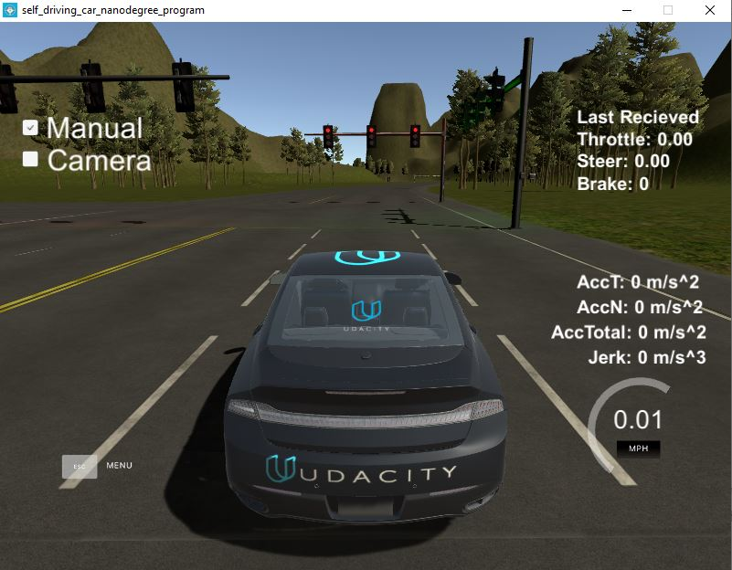
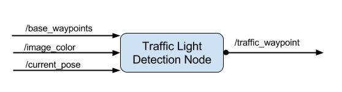
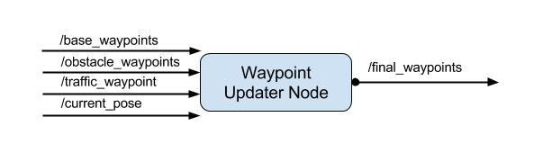
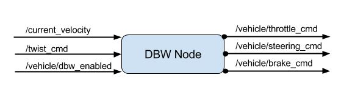
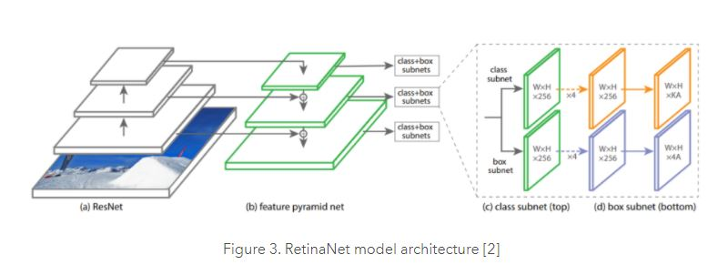
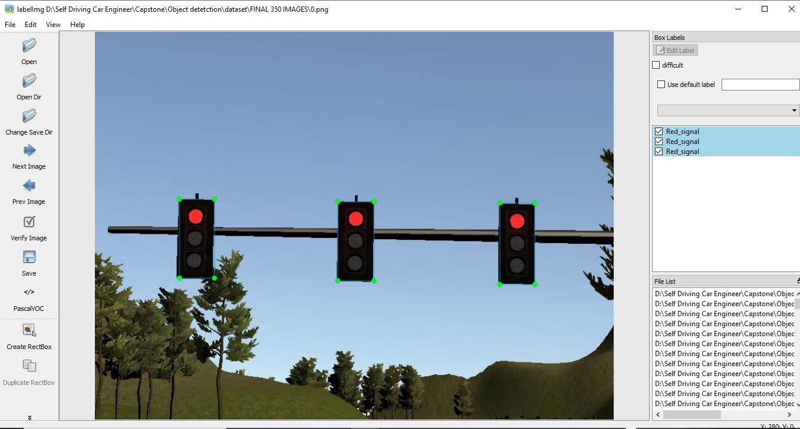
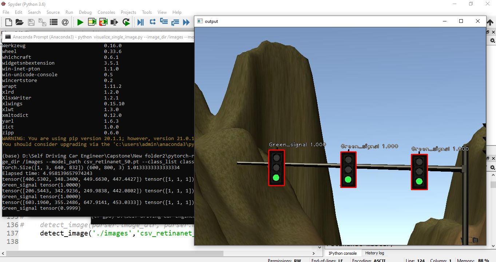
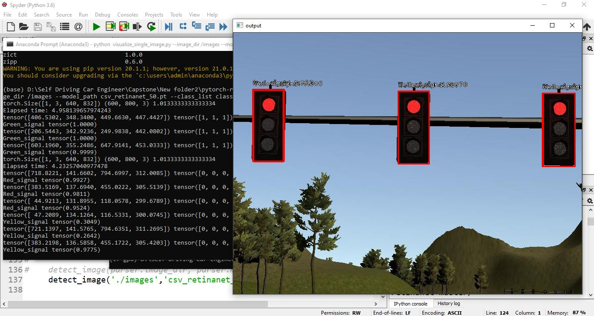
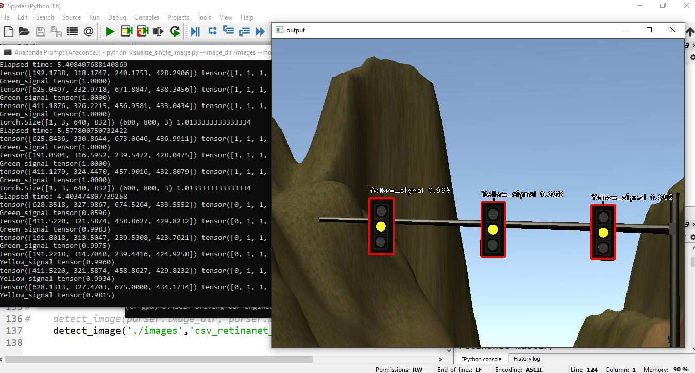

# System Integration

[](http://www.udacity.com/drive)



<h2> Overview </h2>

<p> The project focusses on developing the complete architecture of a self driving car. The architecture includes four crucial subsystems. The Sensors subsystem,perception subsystem,planning subsystem and control subsystem. The output of the control subsystem is send to the Simulator based on Carla to test the result. The goal is to make the car follow a trajectory around an highway without violating the traffic rules and without causinn accidents.The system uses ROS as a backend to perform the task of the four subsystems and a simulator made in Unity as the front end to test the results.</p>

<h2> System Architecture </h2>


<h4>Sensors</h4>

<p>The vehicle uses a RGB camera along with a GPS module. The simulator provides the image through the /image_color topic and the current position of vehicle in the /current_pose topic.</p>

<h4>Perception</h4>



<p>The perception subsystems consists of two nodes. The first node is for Object detetction which is to detect vehicles, pedestrain, traffic signs and traffic lights. The other node is for Traffic light classification. The subsystem subscribes to the topic /image_color,/base_waypoints and /current_pose and publishes to /traffic_waypoint topic. The published topic tells the nodes whether there is any traffic light which is red in the nearby traffic signal in front of the car.</p> 

<h4>Planning</h4>



<p>The planning subsystem also has two nodes. The waypoint loader node loads the static waypoint data and publishes to the /base_waypoints topic the waypoints to be followed.The waypoint updater node subscribes to the topics.
 <UL>
  <LI> /base_waypoints - the waypoints the vehicle should follow from start to goal.</LI>
  <LI> /obstacle_waypoints - the points where obstacle if exist.</LI>
  <LI> /traffic_waypoint - the points where traffic light is present.</LI>
  <LI> /current_pose - the current position of the vehicle.</LI>
 </UL>

The waypoint updater node then publishes to the /final_waypoints topic which is fed to thr controller.</p>

<h4>Control</h4>



<p>The control subsystem consists of two nodes. The Waypoint follower node subscribes to the /final_waypoints topic. The package contains code from Autoware which publises target vehicle linear and angular velocities in the form of twist_commands to /twist_cmd topic. The DBW node (Drive by wire) subscribes to the /twist_cmd, /current_velocity, /vehicle/dbw_enabled topics and publishes throttle,steering angle and brake to the corresponding topics.</p>
 
 ```
 Autoware repo
 https://github.com/Autoware-AI/autoware.ai.git
 
 Project offical repo from Udacity
 https://github.com/udacity/CarND-Capstone.git
 
```

<h2>Various Node and description</h2>

<h4> Waypoint Updater Node </h4>

<p> The waypoint updater nodes finds the current position of the among the list of base_waypoints by querying in the KDtree representation of the base waypoints. The waypointer updater also the gets the position of the nearest traffic light. If stop line point is lesser than the farthest waypoint in the current set of next waypoints then we decelerate and stop before the stopline point.</p>

<p>We use a square root function with a max deceleration limit of 0.5 m/s^2 to perform the deceleration. Finally we publish the /final_waypoints in the Lane message format as below.</p>

```
std_msgs/Header header
  uint32 seq
  time stamp
  string frame_id
styx_msgs/Waypoint[] waypoints
  geometry_msgs/PoseStamped pose
    std_msgs/Header header
      uint32 seq
      time stamp
      string frame_id
    geometry_msgs/Pose pose
      geometry_msgs/Point position
        float64 x
        float64 y
        float64 z
      geometry_msgs/Quaternion orientation
        float64 x
        float64 y
        float64 z
        float64 w
  geometry_msgs/TwistStamped twist
    std_msgs/Header header
      uint32 seq
      time stamp
      string frame_id
    geometry_msgs/Twist twist
      geometry_msgs/Vector3 linear
        float64 x
        float64 y
        float64 z
      geometry_msgs/Vector3 angular
        float64 x
        float64 y
        float64 z
        
```

<h4> DBW Node </h4>

<p> The Drive By Wire Node uses various controller to publish the throttle,braking and steering angle. It uses PID controller to control the throttle. The values of Kp,Ki and Kd are 0.3,0.1,0.0 and the min and max throttle are 0 and 0.2 respectively. The Yaw controller is responsible for generating the steering angles. The current velocity of the car is passed into low pass filter to remove the high noise components. Based on the current velocity, and the required linear and angular velocity the yaw controller generates the steering angle. If the requried linear velocity is very small we stop the vehcile by applying 700 Nm of torque as the simulator by defaults generates acceleration. </p>

<p>The DBW node is currently set up to publish steering, throttle, and brake commands at 50hz. The DBW system on Carla expects messages at this frequency, and will disengage (reverting control back to the driver) if control messages are published at less than 10hz. This is a safety feature on the car intended to return control to the driver if the software system crashes.</p>

<h4> Traffic light Detection Node </h4>

<p> The traffic light detection node also creates a KDtree of the base wayoints useful for querying. Each time an image is received the node performs the detection. Based on the current position of the car we get the nearest traffic light state and the stop line position data from the simulator. The node also perform sanity checks as there might be some error in detection, the simulator keeps a threshold values for the red signal and if the number of detection of the red light is more than that, only then it send the state of the Red light to stop the car.</p>

<h2>Object detection and classification</h2>



<p> The project uses Retinanet Object detector to detect the traffic lights and to classify the state of the light. The car is driven across the simulator and the images of the traffic lights are stored. The size of each image os 800x600. The train set consists of 458 images and the test set consists of 100 images. The train and test images are annotated using the Labelimg software from the repo below
 
 ```
 Labelimg:
 https://github.com/tzutalin/labelImg.git
 
 ```
 
 
 
 <p> We have 3 classes for red,green and yellow signal to classify. The pytorch implementation of the retinanet is trained for 50 epochs. </p>
 
 ```
 Retinanet:
 https://github.com/yhenon/pytorch-retinanet.git
 
 ```
 <p>The train loss and evaluation accuracy is given below</p>
 
 ```
Epoch: 50 | Iteration: 228 | Classification loss: 0.00042 | Regression loss: 0.02160 | Running loss: 0.02259

Evaluating dataset
100/100
mAP:
Red_signal: 0.7845487845487845
Precision:  0.625
Recall:  1.0
Green_signal: 0.7083333333333335
Precision:  0.625
Recall:  1.0
Yellow_signal: 1.0
Precision:  0.625
Recall:  1.0

 ```
 
 <h4> Visualizing the results of object detection </h4>
 
 ```
 python visualize_single_image.py --image_dir /images --model_path csv_retinanet_50.pt --class_list classes.csv
 
 ```
 
 <h2>Output Images </h2>
 
 
 
 <p> The Green signal is detected with weight of 100% </p>
 
 
 
 <p> The Red signal is detected with mean weight of 97.33 % and Yellow signal with mean weight of 51 %.</p>
 
 
 
 <p> The Yellow signal is detected with mean weight of 98.6% and green signal with mean weight of 67.6%. </p>
 
 <h2>Implementation</h2>
 
 ```
 Clone this repo
 cd CarND-Capstone
 pip install -r requirements.txt
 cd ros
 catkin_make
 source devel/setup.sh
 roslaunch launch/styx.launch
 Run the simulator (Simulator repo : https://github.com/udacity/CarND-Capstone/releases)
 
 ```
 
 <h2>Complete video</h2>
 
 <p>Since the pytorch requires 1.8.0 version and torchvision requires 0.8.1 version to work, the object detection is not implemented in the ROS as the ROS package supports python 2.7. So the state of the traffic lights are taken directly from the simulator.</p>
 
```
Video link 
https://youtu.be/EoCdNVOAKZE

```
 

